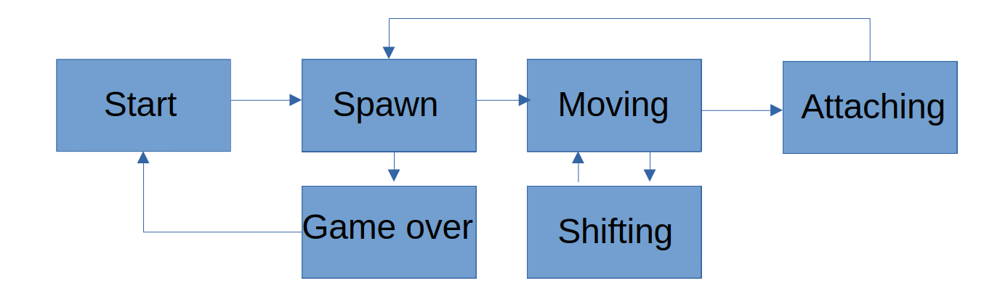

# BrickGame v2.0

BrickGame - это набор игр, имевших популярность в 90ые года, на одноименной платформе. В данной реализации игры созданы две игры - змейка и тетрис.
Разработка производилась на языке С++ 17-го стандарта с использованием парадигмы объектно ориентированного програмирования. 

## Структура проекта

src/brick_game - ĸод библиотеĸи с логиĸой игры

src/controller - ĸонтроллер

src/gui/cli - ĸод консольного модуля отображения

src/gui/desktop - ĸод графичесĸого модуля отображения

## Установка игры

make install

make runc - запуск игры в консольном варианте

make rund - запуск игры в графическом варианте

## Управление

Стерлки клавиатуры - передвижение блоков тетриса/головы змейки

P - пауза

Q - выход из игры

## Паттерн MVC

Игра реализована по паттерну MVC:

Модули приложения разделены на три отдельных макрокомпонента: модель, содержащую в себе бизнес-логику, представление — форму пользовательского интерфейса для осуществления взаимодействия с программой и контроллер, осуществляющий модификацию модели по действию пользователя.

В модуле отображения нет бизнес-логики

Контроллер - тонкий

## Конечный автомат

Start - это состояние, в котором игра начинается

Spawn - это состояние, в которое переходит игра, когда создается блок/яблоко и выбирается следующий блок для спавна. Если спавн невозможен (заполнен тетрис блоками, змейка врезалась в себя или край поля), то игра переходит в состояние конец игры.

Moving — это основное состояние игры с обработкой пользовательского ввода

Shifting - это состояние, в которое переходит игра после истечения таймера.

Attaching - это состояние, в которое переходит игра после того, как текущий блок "касается" уже упавших блоков или земли/ когда змейка съедает яблоко.

Game over - это конец игры.